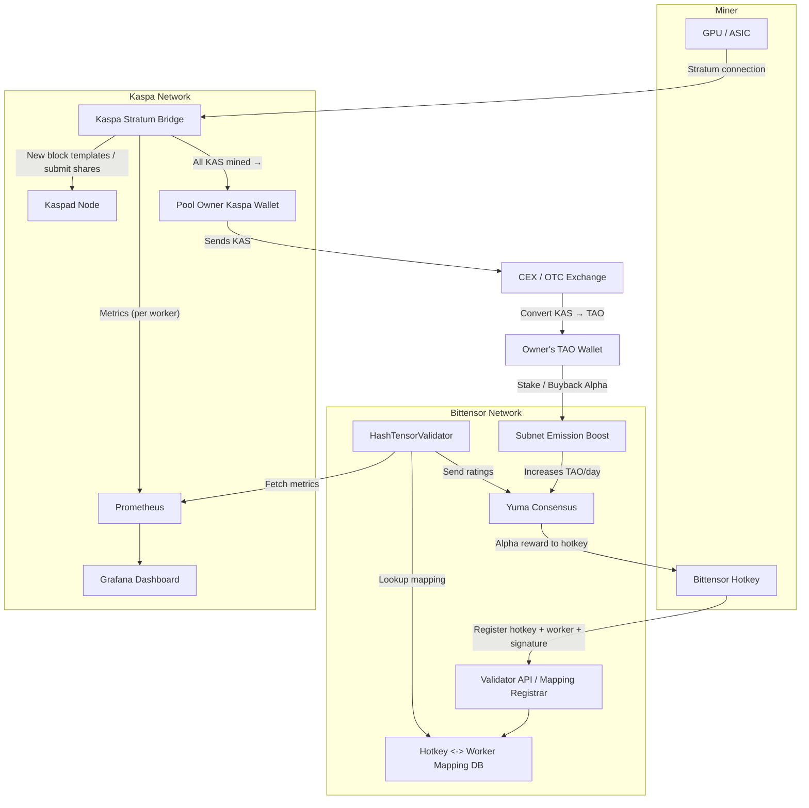

# HashTensor Kaspa Validator

A plug-and-play validator for the HashTensor subnet that tracks Kaspa GPU miners and helps secure the network by providing real-time ratings based on mining activity.

## What is HashTensor?

HashTensor is a decentralized system that connects your Bittensor hotkey to a Kaspa mining worker, monitors its performance, and submits ratings to the Bittensor network. It is designed to be easy to run and requires minimal setup.

## How does it work?

- Tracks Kaspa miners' activity via Prometheus metrics
- Maps Bittensor hotkeys to Kaspa workers
- Validators rate miners based on their contribution
- Rewards are distributed based on ratings and uptime

---

## Scoring Formula

Validators compute a score for each hotkey in four steps, producing a value between 0.0 and 1.0:

1. **Aggregation of Effective Work**
   - Sum each worker’s valid shares multiplied by its difficulty:\
     Effective Work = ∑₍worker₎ (valid\_shares × difficulty)
2. **Normalization**
   - Identify the maximum Effective Work among all hotkeys:\
     max\_work = max₍hotkey₎(Effective Work)
   - Divide each hotkey’s Effective Work by max\_work to obtain a normalized score in [0.0, 1.0]:\
     Normalized Rating = Effective Work / max\_work
3. **Uptime Penalty**
   - Compute the average uptime across a hotkey’s workers (each uptime as a fraction of the monitoring window, from 0.0 to 1.0).\
     Average Uptime = (∑₍worker₎ uptime\_fraction) / (number\_of\_workers)
   - Apply a nonlinear penalty using an exponent α (default α = 2.0):\
     Penalized Rating = Normalized Rating × (Average Uptime)^α
4. **Clamping**
   - Ensure the final score remains within [0.0, 1.0]:\
     Final Rating = max(0.0, min(1.0, Penalized Rating))

By default, a hotkey with perfect work and uptime (Normalized Rating = 1.0, Average Uptime = 1.0) will receive a score of 1.0; partial uptime or lower work reduces the rating accordingly.

---

## System Overview

Below is a high-level diagram showing how Kaspa miners, the validator, and Bittensor interact:



*Diagram: Flow of mining, metrics, mapping, and rewards between Kaspa, Bittensor, and the validator.*

---

## Subnet Registration

> **❗ Before you start:**
>
> You must register your hotkey in the HashTensor subnet before participating.
>
> - For the Finney network, run:
>   ```sh
>   btcli subnet register --netuid 16
>   ```
> - For the testnet, run:
>   ```sh
>   btcli subnet register --netuid 368 --network test
>   ```
>
> If you skip this step, you cannot participate in the subnet.

---

## Hardware Requirements

### Miner

- Modern GPU or ASIC (see [mining guide](docs/mining.md) for details)
- Reliable internet connection
- Sufficient system RAM and storage for mining software

### Validator

| Component   | Requirement                                 |
| ----------- | ------------------------------------------- |
| **CPU**     | 2+ cores                                    |
| **RAM**     | 4–8 GB (for share analysis)                 |
| **Network** | Stable connection to pool API (low latency) |
| **Storage** | Minimal (just logs & lightweight data)      |

Validators don't need GPUs — **they are not mining.**\
They just analyze data and **assign weights properly.**

---

## Get Started

- [**Miner Setup Guide**](docs/mining.md)
- [**Validator Setup Guide**](docs/validating.md)

For detailed installation and configuration instructions, please refer to the guides above.

