# HashTensor Kaspa Validator

A plug-and-play validator for the HashTensor subnet that tracks Kaspa GPU miners and helps secure the network by providing real-time ratings based on mining activity.

## What is this?
This service connects your Bittensor hotkey to a Kaspa mining worker, monitors its performance, and submits ratings to the Bittensor. It is designed to be easy to run and requires minimal setup.

## Why run this validator?
- Help secure the HashTensor subnet
- Earn potential rewards for validating miners
- Simple setup with Docker

## System Overview

Below is a high-level diagram showing how Kaspa miners, the validator, and Bittensor interact:

```mermaid
flowchart TD

%% ==== Miner Identity ====
subgraph "Miner"
    GPU["GPU / ASIC"]
    Hotkey["Bittensor Hotkey"]
end

%% ==== Kaspa Network ====
subgraph "Kaspa Network"
    Kaspad["Kaspad Node"]
    Bridge["Kaspa Stratum Bridge"]
    Prometheus["Prometheus"]
    Grafana["Grafana Dashboard"]

    GPU -->|"Stratum connection"| Bridge
    Bridge -->|"New block templates / submit shares"| Kaspad
    Bridge -->|"Metrics (per worker)"| Prometheus
    Prometheus --> Grafana
    Bridge -->|"All KAS mined →"| Owner["Pool Owner Kaspa Wallet"]
end

%% ==== Bittensor Network ====
subgraph "Bittensor Network"
    Validator["HashTensorValidator"]
    Mapping["Hotkey <-> Worker Mapping DB"]
    ValidatorAPI["Validator API / Mapping Registrar"]
    Yuma["Yuma Consensus"]
    SubnetBoost["Subnet Emission Boost"]

    Validator -->|"Fetch metrics"| Prometheus
    Validator -->|"Lookup mapping"| Mapping
    Validator -->|"Send ratings"| Yuma
    ValidatorAPI --> Mapping
    Hotkey -->|"Register hotkey + worker + signature"| ValidatorAPI
    Yuma -->|"Alpha reward to hotkey"| Hotkey
    SubnetBoost -->|"Increases TAO/day"| Yuma
end

%% ==== Ownership & Emission Loop ====
Owner -->|Sends KAS| CEX["CEX / OTC Exchange"]
CEX -->|"Convert KAS → TAO"| OwnerTAO["Owner's TAO Wallet"]
OwnerTAO -->|"Stake / Buyback Alpha"| SubnetBoost
```



*Diagram: Flow of mining, metrics, mapping, and rewards between Kaspa, Bittensor, and the validator.*

---

> **❗ Before you start:**
> 
> You must register your hotkey in the HashTensor subnet before starting the validator.
> 
> - For the Finney network, run:
>   ```sh
>   btcli subnet register --netuid 16
>   ```
> - For the testnet, run:
>   ```sh
>   btcli subnet register --netuid 368 --network test
>   ```
> 
> If you skip this step, the validator will not function correctly.

---

## 🟢 Quick Start: Remote Docker Compose Setup

1. **Create a new directory for the validator and enter it:**
   ```sh
   mkdir HashTensor
   cd HashTensor
   ```

2. **Download the latest `docker-compose.yml` from the official repository:**
   ```sh
   curl -L -o docker-compose.yml https://raw.githubusercontent.com/HashTensor/HashTensor_Subnet/develop/docker-compose.yml
   ```

3. **Start the validator (and watchtower) in the background:**
   ```sh
   docker compose up -d
   ```
   > ⚠️ **Warning:** By default, the validator will use the wallet name `default` and hotkey `default`. It is strongly recommended to set your own wallet name and hotkey for security and proper operation. See [Wallet Customization: WALLET_NAME and WALLET_HOTKEY](#️-wallet-customization-wallet_name-and-wallet_hotkey) below for instructions.
   
   > **Tip:** You can customize the port by setting the `PORT` environment variable, either in your `.env` file or directly when starting Docker Compose:
   >
   > ```sh
   > PORT=9000 docker compose up -d
   > ```
   >
   > Or edit the `PORT` value in your `.env` file. This is the recommended way to change the port (default is `8000`).

4. **Post your external IP and port to the chain (required for network participation):**
   ```sh
   docker compose exec hashtensor-validator fiber-post-ip \
     --netuid <NETUID> \
     --external_ip <YOUR_IP> \
     --external_port <YOUR_PORT>
   ```
   - See the [Fiber Post IP to Chain documentation](https://fiber.sn19.ai/how-it-works/post-ip-to-chain/) for more details and command options.
   - Make sure the port you specify is open and forwarded to your machine if behind NAT/firewall.

5. **Check if it's running:**
   Use the following command to check the health endpoint from your VPS (replace `$PORT` with your configured port if different):
   ```sh
   curl http://localhost:${PORT:-8000}/health
   ```
   You should see:
   ```json
   {"status": "OK"}
   ```

---

## 🛠️ Alternative: Running with PM2 *(Not Recommended)*

> **Note:** The recommended way to run the validator is with Docker Compose. PM2 is only for advanced users who need to run outside Docker. Most users should follow the Docker instructions above.

If you still want to use PM2:

1. **Clone the repository and set up your environment:**
   ```sh
   git clone <this-repo-url>
   cd HashTensor_Subnet
   python3 -m venv venv
   source venv/bin/activate
   pip install .
   ```

2. **Edit your environment variables in `ecosystem.config.js`:**
   - Open `ecosystem.config.js` and set `WALLET_NAME`, `WALLET_HOTKEY`, `PORT`, and any other variables to match your configuration.

3. **Start the validator with PM2:**
   ```sh
   pm2 start ecosystem.config.js
   ```
   This will launch the validator using the settings from your config file.

4. **Check status and logs:**
   ```sh
   pm2 status
   pm2 logs hashtensor-validator
   ```

> You can use all the same health check and configuration steps as with Docker Compose. PM2 is especially useful if you want to run the validator outside of Docker or manage multiple Node.js apps on your server.

---

## ⚙️ Wallet Customization: WALLET_NAME and WALLET_HOTKEY

You must set your Bittensor wallet name and hotkey for the validator to function correctly. There are two recommended ways to do this:

### 1. Using a `.env` File (Recommended)

1. **Copy the example environment file and rename it:**
   ```sh
   cp env.example .env
   ```
2. **Open `.env` in your editor and fill in your wallet details:**
   ```env
   WALLET_NAME=my_wallet
   WALLET_HOTKEY=my_hotkey
   # You can add other variables as needed
   ```
3. **Start Docker Compose as usual:**
   ```sh
   docker compose up -d
   ```
   > The validator will automatically use the values from your `.env` file.

> See the [env.example](./env.example) file for all available variables you can set.

### 2. Overriding via Command Line

You can also override these variables directly when starting Docker Compose:

```sh
WALLET_NAME=my_wallet WALLET_HOTKEY=my_hotkey docker compose up -d
```

Replace `my_wallet` and `my_hotkey` with your actual wallet name and hotkey.

---

## Registering Your Worker

For full instructions on registering your worker, please see the [HashTensor Miner Registration Guide](docs/mining.md).

## Viewing Metrics
- **Metrics:** [http://localhost:8000/metrics](http://localhost:8000/metrics)

## Configuration
Most settings can be changed via environment variables in `docker-compose.yml`:
- `WALLET_NAME`, `WALLET_HOTKEY`, `WALLET_PATH`: Your Bittensor wallet info
- `SUBTENSOR_NETWORK`: Bittensor network (e.g., `finney`)

## Requirements
- Docker and Docker Compose
- (Advanced) Python 3.12+ if running without Docker
